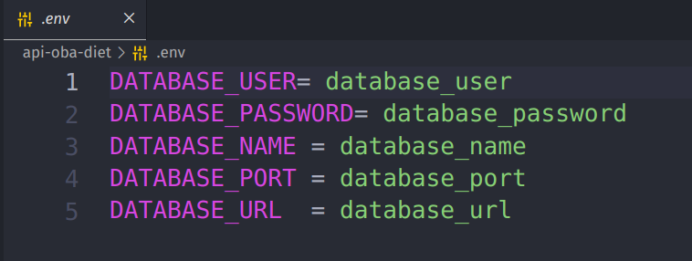

# OBA - ObaDiet 


### _Aplicativo criado para auxiliar na criação de rotinas de alimentação orientado a usuários com enfermidades crônicas, desenvolvido em Ionic Framework._

### Tecnologias 
- Front-end

[](https://ionicframework.com/)

- Back-end

[](https://nestjs.com/)
[](https://sequelize.org)
[]((https://swagger.io/))
[](https://mariadb.org/)

- Design 

[](https://www.figma.com/)

- Biblioteca 

[](https://www.npmjs.com/)

- Plataformas de Hosting

[](https://vercel.com/)

- Ambiente de desenvolvimento 

[](https://code.visualstudio.com/)

- Plataformas e controle de versionamento

[](https://git-scm.com/)
[](https://gitlab.com/)
[	](https://gitpod.io/)

## Como começar


### Configurações: 

- Ao ter o projeto em seu ambiente, o usuário deve iniciar executando o comando de download da Node_modules no terminal onde se localiza a pasta do projeto. Para o uso das variadas dependências que o projeto usa para sua execução.

O comando para instalar a Node_modules e dependências principais:

```sh
npm run all 
```


#### Após Instalar a pasta Node_modules 

O próximo passo é entrar na pasta do projeto principal "_tcc_"

```sh
 cd tcc 
```


O usuário agora pode executar o projeto mobile pelo navegador, usando os comandos:

```sh
 ionic serve
```


# API
## Opcional: 
### _Se o usuário não quiser usar o banco de dados e API que está sendo consumida(obadiet.vercel.app) pelo app. Existe a possibilidade de usar outro banco de dados com a mesma estrutura_

 - O aplicativo consome uma API onde usa  suas rotas para extrair os dados buscado pelo banco de dados.

- Por isso aconselhamos que tenha experiência para fazer essa troca e sincronização de estrutura igual já usada.

### Credenciais do Banco de dados

- O funcionamento do app em maior parte precisa de um banco de dados para o seu uso, assim, o usuário precisa preencher as informações do seu banco de dados no arquivo "_.env_" encontrado na pasta "_api-oba-diet_ ".




### sendo os dados: 
 - Nome do host do banco de dados
 - Senha do banco dados
 - Nome do banco de dados
 - Porta do banco de dados
 - Url do banco de dados


 ## Executando a API...

- Os comandos para executar a API é simples
  - 1º Entre na pasta da API :
  ```sh
   cd api-oba-diet
  ```
  

    - 2º Baixe as dependências da API:
  ```sh
    npm i 
  ```
   

  - 3º Execute a API:
  ```sh
    npm run start:dev
  ```
   


- ### _OBS: Retire todos os links da API encontrados na pasta do projeto _tcc_ para o uso da sua API_

  - Na pasta "_tcc_", na subpasta "_services_"  


  - Retire os links da variável URL e coloque a sua
 


# Criadores do projeto:
   - ## Paulo Roberto(@PauloRoberto_Gaspp/@gaspop25 - Gitlab)
   - ## Mariana Ayumi (@marianakonno - Gitlab)
   - ## Rinaldo(@RinaldoSantos - Gitlab)
   - ## Luis Felippe(@Lima_Felippe - Gitlab)